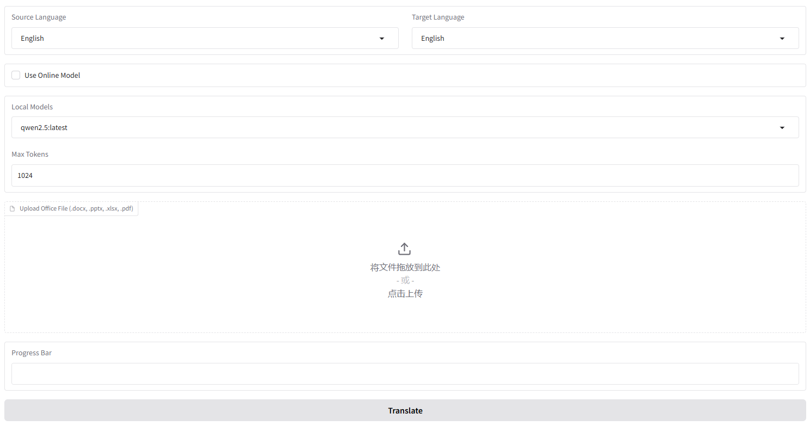
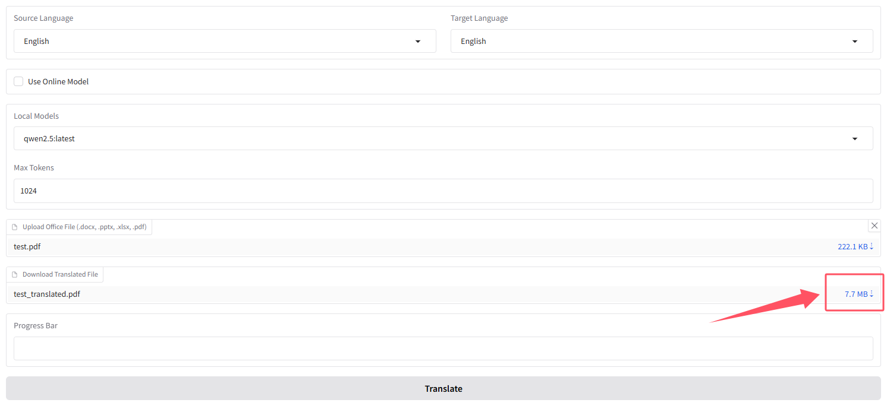
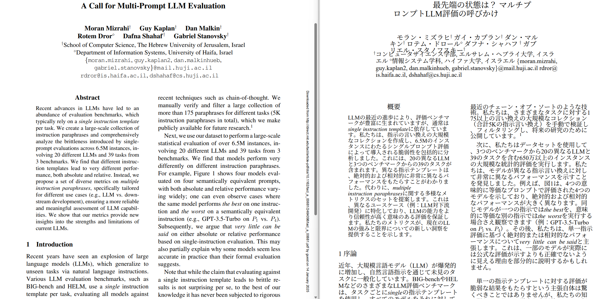

<div align="center">
<h2 id="title">LinguaHaru</h2>

English | [简体中文](README_ZH.md) | [日本語](README_JP.md) 


<div align=center>      </div>
<p align='center'>A free, user-friendly AI translation tool with one-click translation, supporting multiple document formats and languages.</p>


**Model Download / Please save it in the "Models" folder after downloading**  

- [Baidu Netdisk](https://pan.baidu.com/s/1erFEqR4CgR0JwWvpvms4eQ?pwd=v813)
- [Google Drive](https://drive.google.com/file/d/1UVfJhpxWywBu250Xt-TDkvN5Jjjj0LN7/view?usp=sharing)

<h2 id="What's This">What's This?</h2>
This software is a free, user-friendly AI translation tool that supports various document formats and multiple languages.

Here's what it offers:

- One-Click Translation: Easily translate documents with a single click.
- Supported File Types: Accepts .docx, .pptx, .xlsx, .pdf, .txt, and .srt files, with more formats to be added in the future.
- Language Options: Supports translation between 10+ languages, with plans to expand further.
- Flexible Translation Models: Supports both local models and online API-based translation.
- Local Network Sharing: Share translation capabilities within a local network.


<h2 id="install">Installation and Usage</h2>
</details>

1. [CUDA](https://developer.nvidia.com/cuda-downloads)   
You need to install CUDA (Currently there are no problems with 11.7 and 12.1 tests)  

2. Python (python==3.10)
    It is recommended to use [Conda](https://www.anaconda.com/download) to create a virtual environment  
    ```bash
    conda create -n ai-translator python=3.10
    conda activate ai-translator
    ```

3. Install requirements
    ```bash
    pip install -r requirements.txt
    ```

4. Run the tool
    ```bash
    python app.py
    ```

5. Local large language model support  
    Now just support [Ollama] (https://ollama.com/  )
    You need to download Ollama dependencies and models for translation
    - Download model (QWen series models are recommended) 
    ```bash
    ollama pull qwen2.5
    ```
</details>

## APP
### Instructions

- Select Language  
Select the source language (the language of the source file) and the target language (the language you want to translate into).  
- Select Model  
In Model, you can select the model downloaded by ollama. It is not recommended to modify Max_tokens (unless you understand LLM well enough).  
- Upload File  
Click Upload Office Flie/drag the file to this location to upload the file need to be translated.  
The program will automatically determine the file type to be translated.  
- Start Translate   
Click Translate and the program will start translating.  
- Download Translated File  
When the translation is completed, the translated file will be returned at Download Translated File.  
You can also view the translation results in the ~/result folder.  

Added Online mode, currently only supports Deepseek-v3 (Cheap and fast->0.1 CNY/million tokens)  
After selecting Online mode, you will need to enter API-KEY. Please refer to the official website for how to obtain it  
https://www.deepseek.com/

After the translation is completed, a download box will pop up.

### Example 
- Excel File: English to Japanese  
  
- PPT File: English to Japanese  
  
- Word File: English to Japanese  

- PDF File: English to Japanese  


The default access address is
```bash
http://127.0.0.1:9980
```
If you need to share in the LAN, please open the last line
```bash
iface.launch(share=True)
```

## Referenced Projects
- [ollama-python](https://github.com/ollama/ollama-python)
- [PDFMathTranslate](https://github.com/Byaidu/PDFMathTranslate)

## To be updated
- Support more models and more file types

## Software Disclaimer  
The software code is completely open-source and can be freely used in accordance with the GPL-3.0 license.  
The software only provides AI translation services, and any content translated using this software is unrelated to its creators.  
Users are expected to comply with the law and engage in legal translation activities. 

Qwen Model Disclaimer  
The code and model weights are fully open for academic research and support commercial use.  
Please refer to the Qwen LICENSE for detailed information on the specific open-source agreement. 

## Changelog
- 2025/02/01  
Updated the logic for translation failure text.
- 2025/01/15  
Fixed a bug in PDF translation, added multi-language support, and petted a kitty.
- 2025/01/11  
Add support for PDF。Referenced Projects：[PDFMathTranslate](https://github.com/Byaidu/PDFMathTranslate)
- 2025/01/10    
Add support for deepseek-v3. Now you can use the api for translation. (more stable)  
API GET: https://www.deepseek.com/
- 2025/01/03  
Happy New Year! The logic has been revised, a review feature has been added, and logging has been enhanced.
- 2024/12/16  
Update Error detection and Re-translation
- 2024/12/15  
Added some validations and fixed the bug of getting context function
- 2024/12/12  
Updated the handling of line breaks. Fixed some bugs